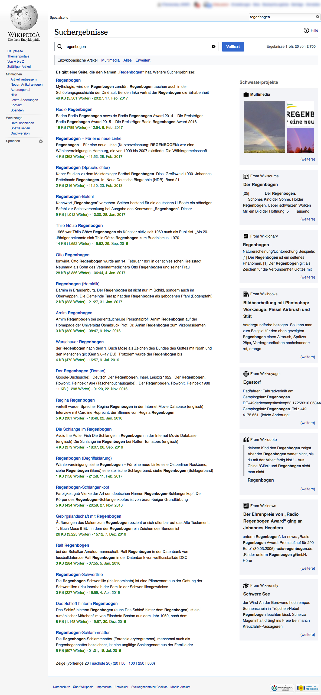

# Cross-wiki Search A/B Test

This repo is the analysis and report codebase for [Discovery](https://www.mediawiki.org/wiki/Special:MyLanguage/Wikimedia_Discovery)'s [test of cross-wiki search](https://www.mediawiki.org/wiki/Cross-wiki_Search_Result_Improvements/Testing):

See [T149806](https://phabricator.wikimedia.org/T149806), [Discovery 2016-17 Q3 goals](https://www.mediawiki.org/wiki/Wikimedia_Engineering/2016-17_Q3_Goals#Discovery), and [Cross-wiki Search Result Improvements](https://www.mediawiki.org/wiki/Cross-wiki_Search_Result_Improvements) for more information.

The final report can be accessed by visiting [https://wikimedia-research.github.io/Discovery-Search-Test-CrosswikiSidebar/](https://wikimedia-research.github.io/Discovery-Search-Test-CrosswikiSidebar/) or by viewing the [PDF version on Wikimedia Commons](https://commons.wikimedia.org/wiki/File:A_Test_Of_Cross-wiki_Search_-_Helping_Users_Discover_Content_On_Wikipedia%E2%80%99s_Sister_Projects.pdf).

This work is licensed under the Creative Commons Attribution 4.0 International License, so if you see anything you like and want to use, you are welcome to do that with attribution. To view a copy of this license, visit [http://creativecommons.org/licenses/by/4.0/](http://creativecommons.org/licenses/by/4.0/).
